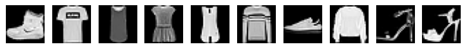
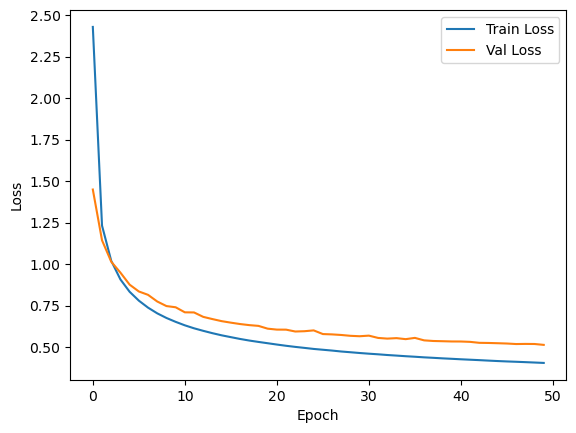
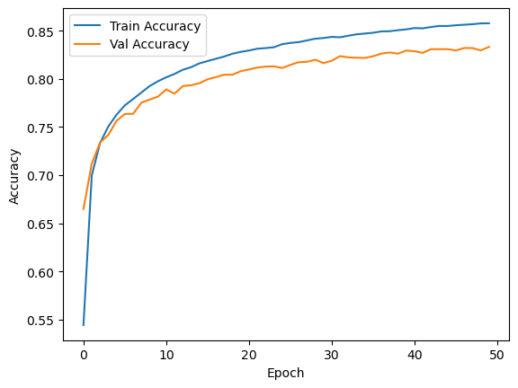
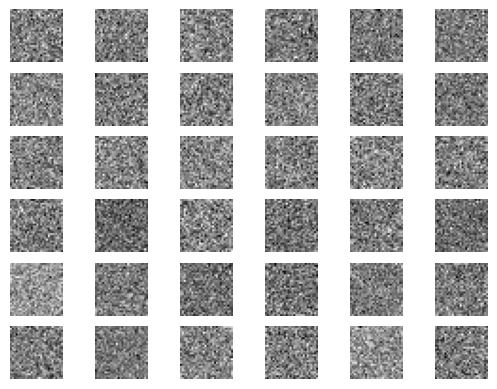
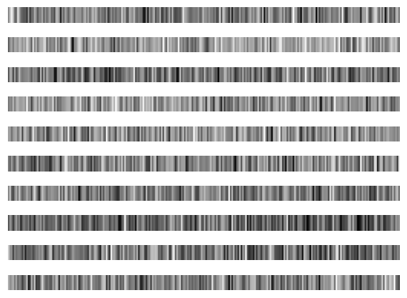

# 实验报告

本次实验使用了 numpy 库实现了一个简单的三层全链接神经网络（一个隐藏层），在 Fashion-MNIST 数据集上进行训练和测试，实现简单的分类任务。代码可以在 https://github.com/Xiaokai-Lin/nndl_hw1 中查看代码和下载权重文件。其中训练集、验证集、测试集上传至百度云（链接: https://pan.baidu.com/s/1qUnKr2hlLR_CPPhBulenqg 提取码: krp3），可下载。

## 数据集简介

Fashion-MNIST 数据集是一个包含 10 个类别的服装图片数据集，每个类别包含 60000 张训练图片和 10000 张测试图片。每张图片的大小为 28x28 像素。训练集前 10 个图片可视化如下：


## 模型介绍

1. 网络层数：模型为一个三层全链接神经网络，包含一个输入层、一个隐藏层和一个输出层。
2. 激活函数：隐藏层使用 ReLU 激活函数，输出层使用 SoftMax 激活函数。
3. 损失函数：损失函数选择为交叉熵损失函数加上 L2 正则化项。其公式如下：

   $$
   L = -\frac{1}{N} \sum_{i=1}^{N} \sum_{j=1}^{C} y_{ij} \log(\hat{y}_{ij}) + \frac{\lambda}{2} \sum_{l=1}^{L} \sum_{i=1}^{H_l} \sum_{j=1}^{H_{l+1}} w_{ij}^{(l)} w_{ij}^{(l)}
   $$

   其中 $N$ 为样本数量，$C$ 为类别数量，$H_l$ 为第 $l$ 层的神经元数量，$w_{ij}^{(l)}$ 为第 $l$ 层第 $i$ 个神经元到第 $l+1$ 层第 $j$ 个神经元的权重。

4. 优化算法：优化算法选择为随机梯度下降 (Stochastic Gradient Descend, SGD) 算法，其更新公式如下：

   $$
   w_{ij}^{(l)} = w_{ij}^{(l)} - \alpha \frac{\partial L}{\partial w_{ij}^{(l)}}
   $$

   其中 $\alpha$ 为学习率。

## 代码实现

本次实验中模仿了 PyTorch 的接口设计，实现了一个简单的神经网络框架，与网络有关的类包括 Linear、ReLU、Sigmoid、SoftMax、CrossEntropyLoss 等。其大部分结构如下：

```python
class Linear:
    def __init__(self):
        # Initialize some parameters like weights and bias.
        pass

    def forward(self, x):
        # Forward pass
        pass

    def backward(self, grad_output):
        # Some gradient calculation
        return grad_input

    def __call__(self, x):
        return self.forward(x)
```

## 实验结果

### 损失函数和准确率

本次实验在 Jupyter Notebook 中完成，实验显示最佳的模型参数为隐藏层神经元数量为$256$，学习率为$0.5$，正则化系数为$0$，权重衰减率选择为$0.0001$，激活函数选择为 Sigmoid 函数。超参数查找使用了网格搜索的方法，对隐藏层神经元数量、学习率、正则化系数、权重衰减率、激活函数等超参数进行了搜索。最终得到了最佳的超参数组合。该模型在训练集以及验证集上最终分别达到了$85.78\%$和$83.33\%$的准确率。其表现如下图：





同时，模型在测试集上测试结果有$83.03\%$的准确率。

### 模型参数可视化

1. 对于输入层到隐藏层的权重可视化使用主成分分析进行可视化结果如下：
   
   由于输入层到隐藏层的权重较多，故使用主成分分析进行了降维，将权重可视化在二维平面上。但可以发现各个成分分布较为杂乱，可能因为服饰图片的特征较为复杂，故无法直接从权重中看出明显的特征。
2. 对于隐藏层到输出层的权重可视化如下图所示（由于与图片的结构无直接关系，故用一维形式展示）：
   
